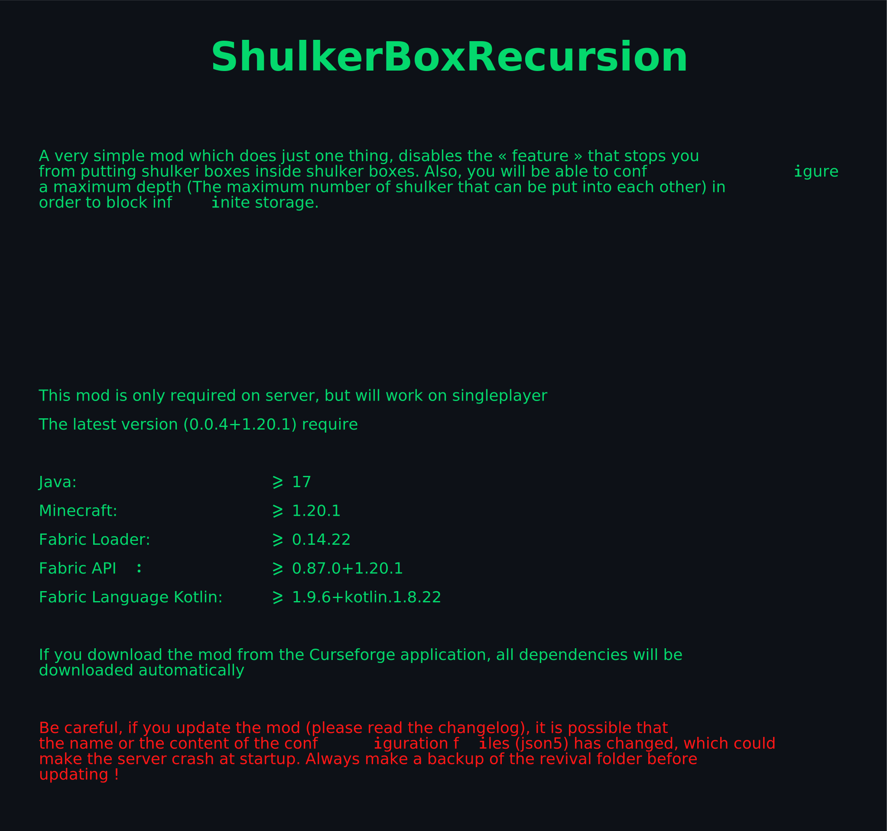
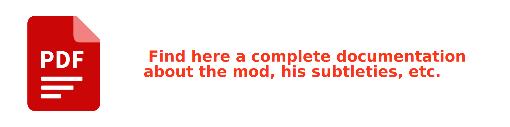

[//]: # ([]&#40;&#41;)
[//]: # ([]&#40;./docs/readme.pdf&#41;)

You have created a modpack and a modded server, and you want to make sure that your friend
connects with the right mods, that he has not altered them.
For example, he could delete some of them or add the xray.jar mod. Something you don't want of course.

When you create the modpack and the modded server, you will also have to create
a file called integrity.json, this file will contain the names of the jar files
as well as their respective hash for the mods you put in the original modpack.
This file will have to be copied in the config folder of the server inside the 
folder called Integrity (If the Integrity folder doesn't exist, you can start
the server once with the Integrity mod, it will then be created)

concerning the hash of the files, be sure to use the SHA-256 algorithm and that the hash is in lower case

check this video to understand how it works -> https://youtu.be/HDsvAae6k78

### How does it work internally ?

When you connect to the server, you send at the same time data in json format
representing the names of the mods in the modpack and their hashes.
When the server receives the data, it compares it with its own data
from the configuration files (integrity.json). If the data you sent
matches the integrity.json file, then you will be allowed to play
on the server. Otherwise, you will be disconnected.

___

    Did you like the mod ?

    Sponsor me !

    
    

## License

This mod is licensed under the MIT license. You can freely include the mod on any modpack with no permission. Usage of this mod's code on other projects is allowed as long as attribution is given.