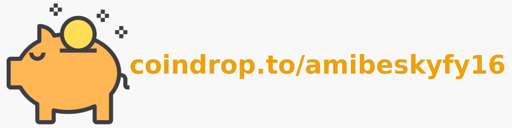

[//]: # ([]&#40;&#41;)

[//]: # ([]&#40;./docs/readme.pdf&#41;)

Make sure the client contains only the mods you want when it connects to your server

This mod allows to check the mods present on the client, when it connects to a server.
The server has a file called modpack-mods-list.json which contains the mods that must be
present on the client (You have to manually configure this either by putting the mods you want the client to have when it connects). When the client connects to the server, the client sends the names
of the .jar files for each mods present in the mods folder. The server then checks if the mods
sent match the list. If it does, the player will not be disconnected.

IMPORTANT: the fileHash has to use the SHA-256 algorithm

___

    Did you like the mod ?

    Sponsor me !

    
    

## License

This mod is licensed under the MIT license. You can freely include the mod on any modpack with no permission. Usage of this mod's code on other projects is allowed as long as attribution is given.